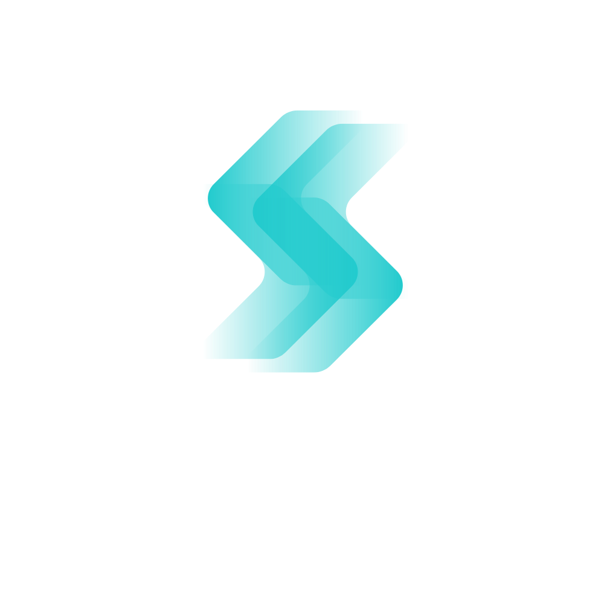
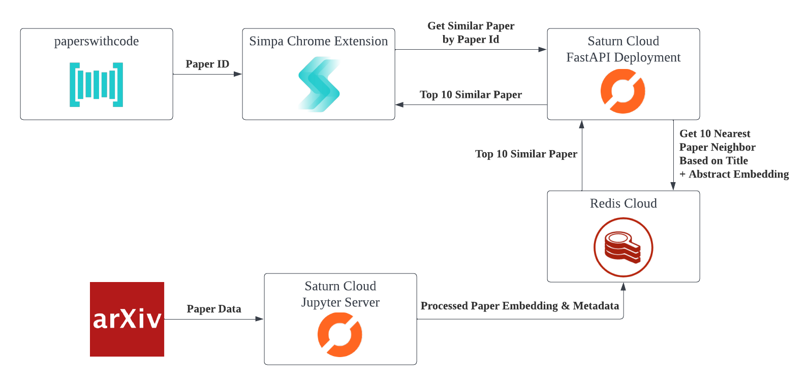
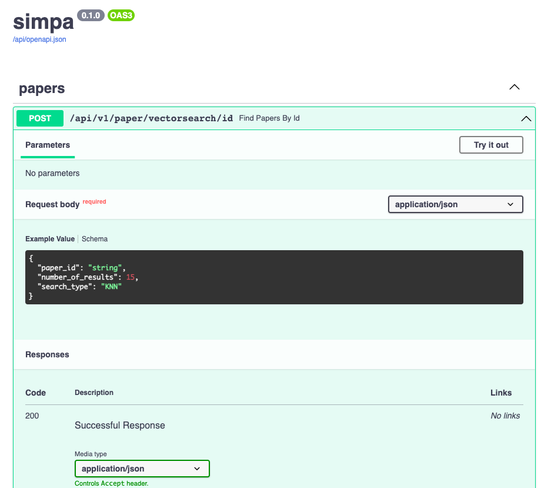

 

Similar paper chrome extension for paperswithcode.com

Chrome extension code: [github.com/christianwbsn/simpa-ext](https://github.com/christianwbsn/simpa-ext)

## Why?
As academia and researcher, have you ever browse [paperswithcode.com](https://paperswithcode.com/) and thought:

> Hmm, this paper is interesting... I wonder are there any similar paper to this?

Because we did, and that's why we built Simpa: a similar paper chrome extension for paperswithcode!

With Simpa you can find out papers that are similar to the paper you're currently browsing as easy as one click! Simpa will also automatically identify the 5Ws + 1H (What, Why, When, Where, Who, and How) of the paper. So you can also easily read what makes them similar & different.

 

## How 
We build Simpa using Redis Cloud Vector Database, Saturn Cloud, and Huggingface. There are 4 main component to this project:
* Text Embedding & Paper Processing
* RediSearch Vector Similarity Search
* Saturn Cloud Webserver
* Google Chrome Extension

Here's an overview of the app:

 

## API Docs
Open API Documentation for our webserver can be accessed here:
[https://simpa.community.saturnenterprise.io/api/docs](https://simpa.community.saturnenterprise.io/api/docs)

 